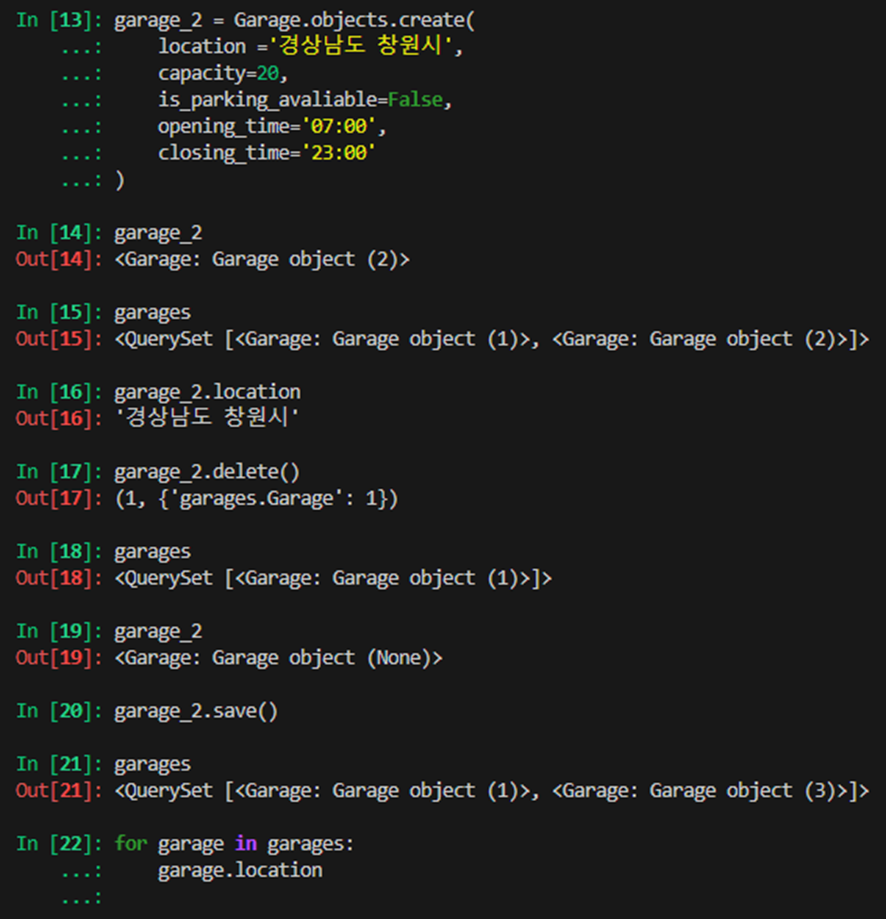

# ORM(Object-Relational-Mapping)
> 객체 지향 프로그래밍 언어를 사용하여 호환되지 않은 유형의 시스템 간에 데이터를 변환하는 기술
- ORM의 역할 : 중간 번역기 역할!!

# QuerySet API
> ORM에서 데이터를 검색, 필터링, 정렬 및 그룹화 하는데 사용하는 도구
> API를 사용하여 SQL이 아닌 'Python코드'로 데이터를 처리
- 요청에 대한 문법
- QuerySet = 다중 데이터 / instance = 단일 데이터


## 구문
```bash
 $ Article.objects.all()
-> Model class - Manager - Queryset API
```

## Query
- 데이터베이스에 특정한 데이터를 보여 달라는 요청
- '쿼리문을 작성한다.' = 원하는 데이터를 얻기 위해 데이터베이스에 요청을 보낼 코드를 작성한다. 
- 파이썬으로 작성한 코드가 ORM에 의해 SQL로 변환되어 데이터베이스에 전달되며, 데이터베이스의 응답 데이터를 ORM이 QuerySet이라는 자료 형태로 변환하여 우리에게 전달

## QuerySet
- 데이터베이스에게서 전닯다은 객체 목록(데이터 모음) 
  - 순회가 가능한 데이터로써 1개 이상의 데이터를 불러와 사용할 수 있음
- Django ORM을 통해 만들어진 자료형
- 단, 데이터베이스가 단일한 객체를 반환할 때는 Query Set이 아닌 모델(Class)의 인스턴스로 변환됨

> Python의 모델 클래스와 인스턴스를 활용해  
> DB에 데이터를 저장, 조회, 수정, 삭제하는 것


# 실습
- 사전 준비 : 외부 라이브러리 설치 및 설정
```bash
 $ Article.objects.all()
-> Model class - Manager - Queryset API
```


### Django shell 
- Django 환경 안에서 실행되는 python shell(입력하는 QuerySet API 구문이 Django 프로젝트에 영향을 미침)


## 데이터 객체를 만드는(생성하는) 3가지 방법





id = pk로 해도 됨

### save()
- 객체를 데이터베이스에 저장하는 메서드
  

## 조회(Read) ★
- all() : 전체 데이터 조회
- get() : 단일 데이터 조회
  - 객체를 찾을 수 없으면 DoesNotExist 예외를 발생시키고, 둘 이상의 객체를 찾으면 MultipleObjectsReturned 예외를 발생시킴
  - 위와 같은 특징을 가지고 있기 때문에  primary key (pk)와 같이 고유성(uniqueness)을 보장하는 조회에서 사용해야 함

- filter() : 특정 조건 데이터 조회
  

## update
- 데이터 수정 : 인스턴스 변수를 변경 후 save 메서드 호출
  

## Delete
- 삭제하려는 데이터 조회 후 delete 메서드 호출


### 참고
- Field lookups : 특정레코드에 대한 조건을 설정하는 방법
- QuerySet 메서드 filter(), exclude() 및 get()에 대한 키어드 인자로 지정됨 
![공식문서] https://docs.djangoproject.com/en/4.2/ref/models/querysets/ - filed - lookups

- ORM, QuerySet API를 사용하는 이유 
  - 데이터베이스 쿼리를 추상화하여 Django 개발자가 데이터베이스와 직접 상호작용하지 않아도 되도록 함
  - 데이터베이스와의 결합도를 낮추고 개발자가 더욱 직관적이고 생삱겅로 개발할 수 있도록 도움