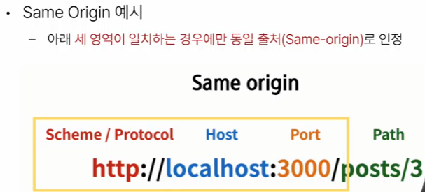

# 1. 프로젝트 개요

## DRF 프로젝트 안내

- 스켈레톤 프로젝트 django-pjt 제공
- 외부 패키지 및 라이브러리는 requirements.txt에 작성되어 있음
- DRF 프로젝트는 주석을 해제하며 진행

## Vue 프로젝트 안내

- 스켈레톤 프로젝트 vue-pjt 제공
- Vite를 사용해 Pinia 및 Vue Router 가 추가 되어있음
- pinia-plugin-persistedstate 가 설치 및 등록 되어있음
- Vue 프로젝트는 직접 코드를 작성하며 진행

### 시작하기 전에….

- 무결점의 프로젝트를 만드는 것이 아님
- front-end 프레임워크와 back-end 프레임워크 간의 요청과 응답, 그 과정에서 등장하는 새로운 개념과 문제를 해결하면서 하나의 웹 애플리케이션 서비스를 구현하는 과정에 집중할 것

# 2. 메인 페이지 구현

## 개요

- ArticleView 컴포넌트에 ArticleList 컴포넌트와 ArticleListItem 컴포넌트 등록 및 출력하기
- ArticleList 와 ArticleListItem 은 각각 게시글 출력을 담당

# 3. CORS Policy

## SOP(동일 출처 정책)(Same-orign policy)
[mdn 문서](https://developer.mozilla.org/en-US/docs/Web/Security/Same-origin_policy)
- 어떤 출처(origin)에서 불러온 문서나 스크립트가 다른 출처에서 가져온 리소스와 상호 작용하는 것을 제한하는 보안 방식

- 웹 애플리케이션의 도메인이 다른 도메인의 리소스에 접근하는 것을 제어하여 사용자의 개인 정보와 데이터의 보안을 보호하고, 잠재적인 보안 위협을 방지
- 잠재적으로 해로울 수 있는 문서를 분리함으로써 공격받을 수 있는 경로를 줄임

### Origin(출처)
- URL의 Protocol, Host, Port를 모두 포함하여 '출처'라고 부름

**http://localhost:3000/articles/3/을 기준으로 동일 출처 여부를 비교**

## CORS policy 의 등장

- 기본적으로 웹 브라우저는 같은 출처에서만 요청하는 것을 허용하며, 다른 출처로의 요청은 보안상의 이유로 차단됨
    - SOP에 의해 다른 출처의 리소스와 상호작용 하는 것이 기본적으로 제한되기 때문
- 하지만 현대 웹 애플리케이션은 `다양한 출처로부터 리소스를 요청`하는 경우가 많기 때문에 `CORS 정책`이 필요하게 되었음

> CORS는 웹 서버가 리소스에 대한 서로 다른 출처 간 접근을 허용하도록 선택할 수 있는 기능을 제공

## CORS (교차 출처 리소스 공유)
- 특정 출처(Origin)에서 실행 중인 웹 애플리케이션이 `다른 출처의 자원에 접근할 수 있는 권한을 부여` 하도록 브라우저에 알려주는 체제
- 만약 다른 출처의 리소스를 가져오기 위해서는 이를 제공하는 `서버`가 브라우저에게 다른 출처지만 접근해도 된다는 사실을 알려야함

## CORS policy(교차 출처 리소스 공유 정책)
- 다른 출처에서 온 리소스를 공유하는 것에 대한 정책
- 서버에서 설정되며, 브라우저가 해당 정책을 확인하여 요청이 허용되는지 여부를 결정
- 다른 출처의 리소스를 불러오려면 그 출처에서 올버른 `CORS header`를 포함한 응답을 반환 해야함
- 이 응답 다른 출처지만 포함시켜줘!

- Server : 브라우저님, 저희 응답 HTTP Header에 "Access-Control-Allow-Origin": 도메인A"가 포함되었습니다. 이제 도메인 A에서의 요청은 우리 자원에 접근 할 수 있음을 알려드립니다. 

# 4. Article CR 구현