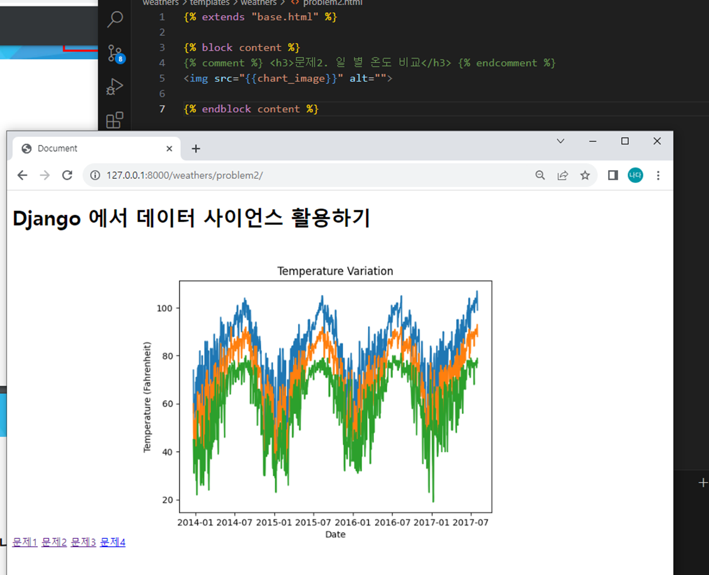
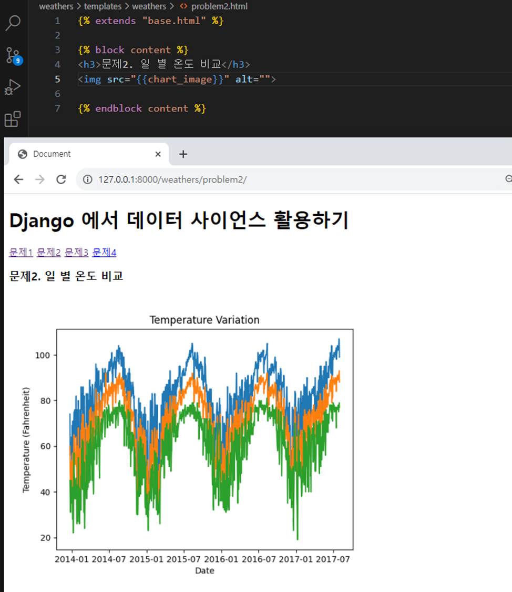

# 20231006
파일이름을 matplotlib 으로 하면 matplotlib 본인을 불러오는게 되니까 재귀가 되어서 실행이 안됨

image_base64 = base64.b64decode(buffer.getvalue()).decode('utf-8').replace('\n', '')
할 때 괄호 잘 닫아주기

return render(request, "index.html", context) 에서 context 안넣어줘서 그래프 계속 안나왔었음ㅎㅎㅎ
pandas wheather할때도 또 context  안넣고 왜 데이터가 안나오지 하고 있었다. 
context 잘 넘겨주자~!~!~!

example 인데  exemple 쳐서 오류남

## mypjt
python -m startapp weathers이 아니라
python manage.py startapp weathers 해줘야 앱이 만들어지지 바부야

INSTALLED_APPS = []에 앱 등록하는거 잊지 말자! runserver하기 전에 생각나서 등록함.

- base.html에서 content 내용이 2개 중복되서 오류남 -> 이름 style로 바꿔서 오류 수정(block 안에 들어가는 이름 안겹치게 하기!)

- ' <a href="weathers:problem1"> 문제4</a> '이케 하면 url주소가 없잖아
<a href="">문제1</a> 이렇게
 DTL의 URL tag를 써서 a태그의 href 속성에 작성될 url을 만들어 줘야한다!!

 Q.  이거랑
  이거의 차이가 뭘까?
 
 Q. urls.py에서 app_name 안붙이니까 오류떴는데 붙이니까 오류 사라짐 왜지??
   <a href="">문제1</a>
  <a href="">문제2</a>
  <a href="">문제3</a>
  <a href="">문제4</a>
  => 이렇게 해두면 weathers의 problem1을 찾아들어가야 해서 weathers라고 앱 네임을 붙여줘야 하는거고 

  <a href="">문제1</a>
  <a href="">문제2</a>
  <a href="">문제3</a>
  <a href="">문제4</a>
  => 그래서 이렇게 바꾸면 app_name 설정 안해도 오류 안뜬댱~!~!~

문제 3번에서 범위 오류뜨는거 데이터에서 쩌밑에 데이터가 이상한거 있는게 있어서 써야하는 column만 가져오도록 usecols=range(0,4) 사용해서 문제 해결함