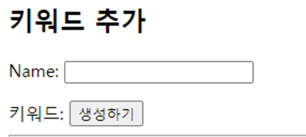

# models.py
- serch_period에서 검색기간 데이터유형이 text인데 모델 필드를
textfeild로 할지 charfeild로 할지 고민됨 근데 별로 길지 않을 것이라서 max_length 를 100으로 주고 charfeild로 해둠!
=> 이거 하다가 깨달았는데 그림을 보면 textfield 하면 되었었다.

- 모델만들고 -> view 만들고 -> html 기본틀 만들어두기 


Name 자리에 키워드가 적히게 하려면 forms.py의  KeywordForm에 
name = forms.CharField(max_length=100, label='키워드')를 추가해준다 


# 키워드 삭제 및 리다이렉션(B)
```python
def keyword_detail(request, pk):
    keyword = Keyword.objects.get(pk=pk)
    keyword.delete()
    return redirect('trends:keyword') 
``` 
1. views.py : 리다이렉트를 keyword가 아니라 keyword_detail로 넘겨주면서 pk를 함께 주고있었어서 오류가 났음
2. views.py : keyword = Keyword.objects.get(pk=pk) 에서 Keyword.objects를 받아와야 하는데 Trend.object를 받아와서 오류 남. 우리가 만들고 있는 건 Keyword에 데이터를 담아놓고 엉뚱하게 Trend에서 데이터를 받아오려고 하니까 안됨!!
3. url.py : path('keyword/<int:pk>/', views.keyword_detail, name='keyword_detail') 에서 주소경로 적을 때 마지막 '/' 빠짐

# C. crawling.html
views.py에서 
from bs4 import BeautifulSoup
from selenium import webdriver 
import 해두고 시작

```python 
def get_google_data(keyword):
    url = f'https://www.google.com/search?q={keyword}'
    
    driver = webdriver.Chrome()
    driver.get(url)

    html = driver.page_source
    soup = BeautifulSoup(html, "html.parser")

    result_stats = soup.select_one("div#result-stats") 
    return result_stats.text
```
크롤링 해서 데이터를 불러오기
불러온 데이터 정제해서 숫자만 num = '' 넣어줌 
이 데이터가 Trend 쿼리에 저장해둔 데이터를 trends에 불러와서
여기 있는 데이터를 활용해서 crawling.html에서 rendering되게 함

```python
if Trend.objects.filter(name=key.name, search_period='all').exists():
        t = Trend.objects.get(name=key.name,result = int(num), search_period='all')
        t.result = int(num) # Trend의 result 컬럼에다가 우리가 받아온 int(num)값을 넣어준다.
        t.save() # 테이블 값 생성
else:
    Trend.objects.create(name=key.name,result = int(num), search_period='all')
```
- 이미 저장되어 있는 키워드라면, 새로 생성하지 않고 검색 결과 개수를 변경하는 것은
views.py에서 if_else 조건문으로 필터와 생성을 해주었다.

# D.