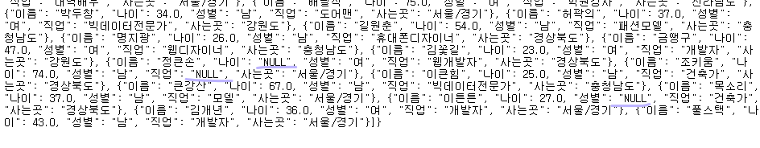
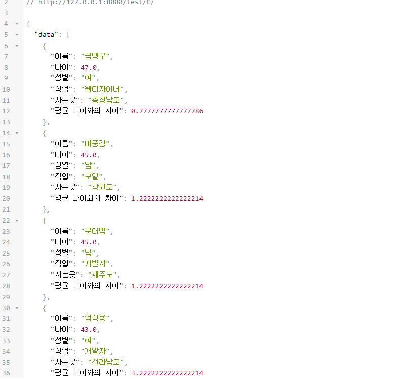
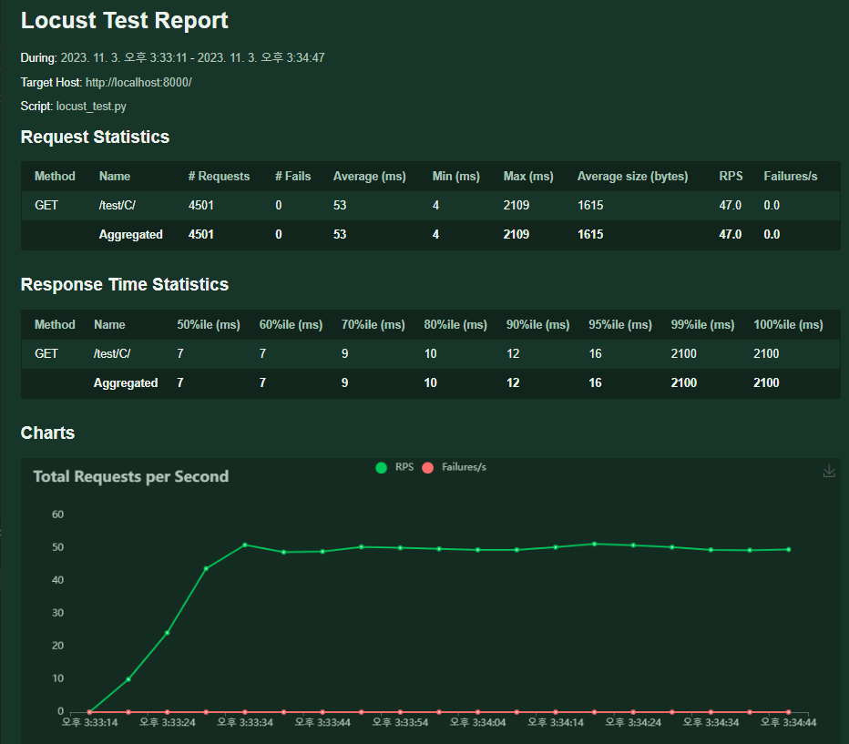
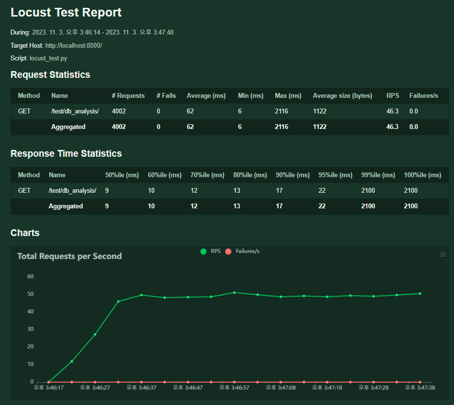
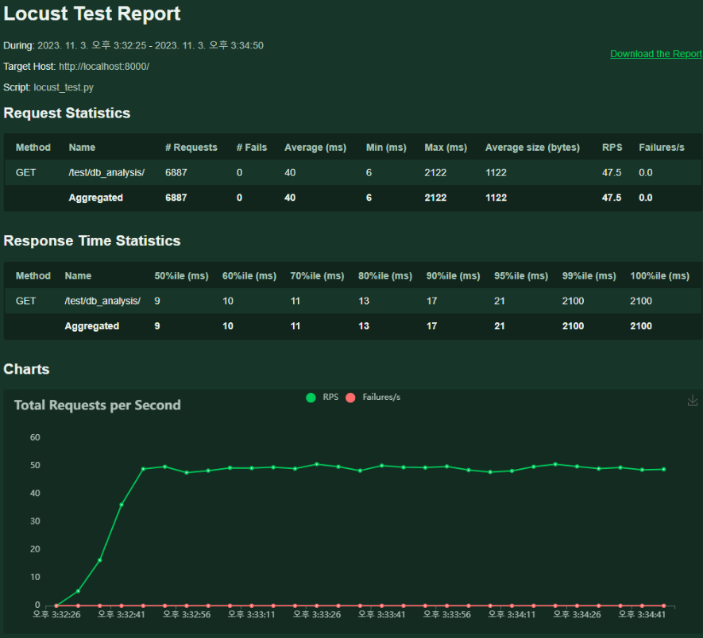
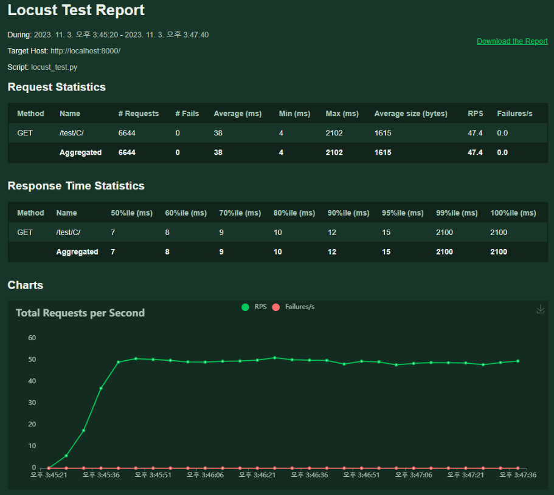
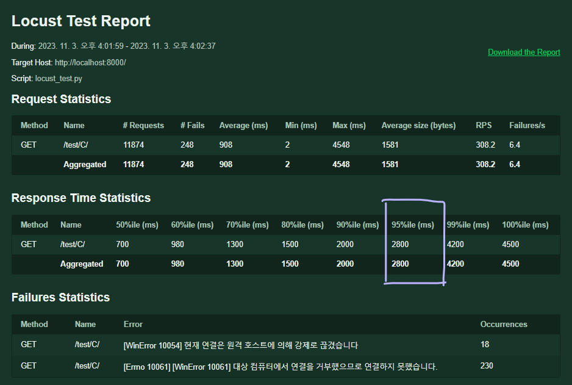
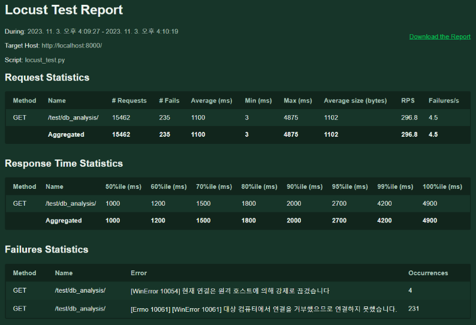
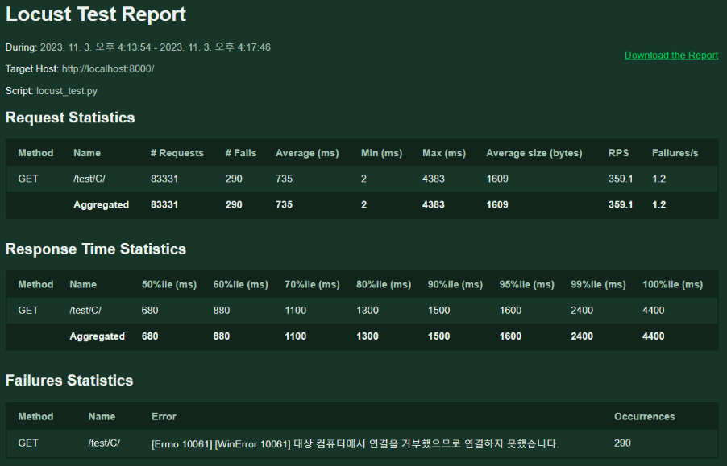

# Live
[locust docs](https://docs.locust.io/en/stable/installation.html)
	
> 왜 API 성능 테스트일까? 
DRF 를 통해서 API서버를 만들었기 때문에 REST-server만들어놓고 테스트하는거죠

Locust =  메뚜기
```bash
$ 메뚜기명령어 -> locust -f locust_test.py
```
- @ 데코레이터 -> 실제로 서버로 요청을 보내는 메서드구나 하고 표시를 해주는 것

http://localhost:8089/


# B

```python
def B(request):
    file_path = 'data/test_data_has_null.csv'
    
    df = pd.read_csv(file_path, encoding='cp949')
    # data = df.to_dict('records')를 return위에 안두고 여기다 두고 했더니  JSON형태(리스트 형태)라고 오류(AttributeError: 'list' object has no attribute 'fillna'????)나서 위치 옮겼다. 
    data = df.to_dict('records') 

    df.fillna('NULL', inplace=True)
    print(df.isna().sum())
    return JsonResponse({'data': data}, json_dumps_params={'ensure_ascii': False}, status=200) 
    # return JsonResponse({'data': replace_null})
```

========= 아래와 같이 순서를 바꿔서 오류를 해결했다 =========



```python
def B(request):
    file_path = 'data/test_data_has_null.csv'
    
    df = pd.read_csv(file_path, encoding='cp949')
    # df.head()
    # replace_null = data.fillna("NULL", inplace=True)
    df.fillna('NULL', inplace=True)
    print(df.isna().sum())
    '''
    이름     0
    나이     0
    성별     0
    직업     0
    사는곳    0
    '''
    data = df.to_dict('records')
    return JsonResponse({'data': data}, json_dumps_params={'ensure_ascii': False}, status=200) 
    # return JsonResponse({'data': replace_null})
```

# C

> 평균나이와의 차이 필드를 생성할 때, 
```python 
df['평균 나이와의 차이'] = abs(sorted.df['나이'] - average_age)
```
- 이렇게 했더니 sorted가 df에 없는 함수라고 하면서 오류가 떠서 sorted 없애주고

```python 
df['평균 나이와의 차이'] = abs(df['나이'] - average_age)
```
- 이렇게 해서 오류 해결했다. 


# D
> 총 접속자 : 100 명으로 했다가 1000명으로 늘림

> 동시 접속자 : 10명했다가 100명으로 늘림

## 수정 전
### 1. my_computer_my_views(100/10)



### 2. my_computer_pair_views(100/10)



### 3. pair_computer_pair_views(100/10)



### 4. pair_computer_my_views(100/10)



> __두 코드의 속도에 차이가 나는 이유__
> 1.  file_path = 'data/test_data_has_null.csv'
df = pd.read_csv(file_path, encoding='cp949') 로 변수에 경로 넣어서 해준 점에서의 차이
> 2. sorted 와 nsmallest 의 사용 메서드 차이
> 3. .dropna()에 .mean() 를 이어서하면 한번에 다 해야해서 더 느려지는 것 같다..?


## 수정 후 
 
> 1. file_path = 'data/test_data_has_null.csv'
df = pd.read_csv(file_path, encoding='cp949')를 전역변수 설정해주고 
> 2. 코드 짜면서 테스트한다고 print 해뒀던거 주석처리 해줬다.

### 5. my_computer_my_views(1000/100)


### 6. pair_computer_pair_views(1000/100)


### 7. pair_computer_my_views(1000/100)
