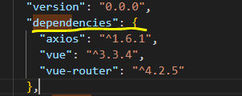
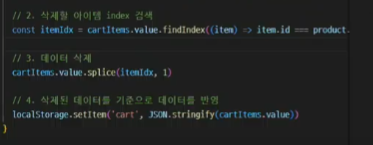

# 09_pjt

-----

## 혜원 
> 오늘 만들어야 하는 것
1. 전체 페이지
2. 상세 페이지
3. 장바구니

```bash
 $ npm install axios
```
> added 9 packages, and audited 37 packages in 1s 
5 packages are looking for funding
  run `npm fund` for details 
found 0 vulnerabilities


-> npm 패키지를 통해서 패키지 관리할수 있음
 => 설치된 것 확인 가능(package-lock.json에서)

## 데이터 불러오기


## products 출력


## 상세 페이지 이동


## 장바구니 추가 
- 임시로 데이터를 저장할 공간
- 브라우저의 스토리지

### Local Stroage
- 반영구적으로 브라우저에 저장할 수 있는 공간
  -> 반영구적? 브라우저를 껐다 켜도 데이터가 유지됨
- 5MB 정도의 데이터를 저장할 수 있음
  -> 쿠키보다 많은 데이터를 저장할 수 있다. 
- 보안이 조금 위험하다
  -> 최대한 위험 수준이 낮은 데이터만 저장해야 한다. 
- value에는 무조건 문자열만 저장 가능 ★

- 브라우저 쪽에 임시로 저장하고 싶은 데이터가 있다? 
그런데, 보안 수준이 낮다?
-> 그럴 때 로컬 스토리지 사용이 좋은 선택지가 될 것이다!



이케 해줘도 됨


### ========================================


## 성주 